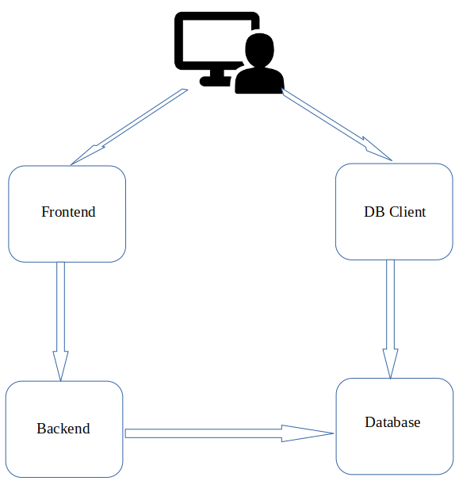

# Task Management App

This application consists of a _frontend built with React_ and a _backend built with Flask_. The backend is using _Mariadb_ instance for stroing data. It allows users to _manage tasks_, _create new tasks_, and _remove existing tasks_.



## Prerequisites

Before deploying the application, ensure you have the following prerequisites installed:

- Node.js & npm - for frontend
- Python 3 - for backend
- Mariadb - for storing created tasks 

## Installation and Usage

#### Frontend
- Configure environment variables in _.env_ file
- Install dependencies required in package.json file 

    ```sh
    npm install
    ```
- Launch the application using

    ```sh
    npm start
    ```
- Other basic commands are same as for the normal react project

#### Backend
- Configure environment variables in _.env_ file
- Install following required dependencies 

    ```sh
    flask 
    flask_sqlalchemy 
    pymysql 
    python-dotenv 
    flask-cors
    ```
- Launch the application using

    ```sh
    python3 main.py
    ```
#### Database
- Install _Mariadb_ database
- Create a _database_ and _user_ for the application
- Create all initially required tables and data in created database using _init.sql_ file in _backend/init.db/_ folder

#### Database Client
- Use any database client such as _phpmyadmin_ to easily interact with databse
